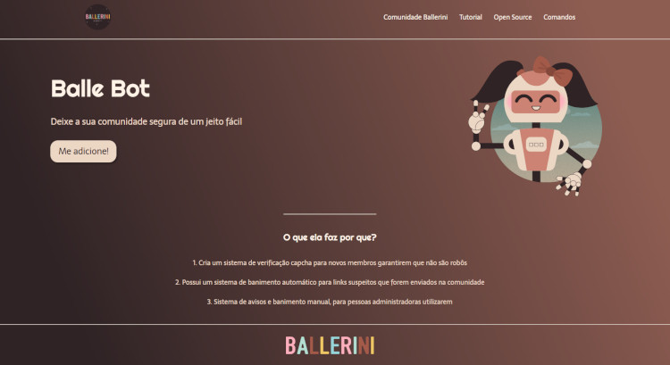

# 

<h1 align="center"> Projeto Bale Bot </h1>

   

O Projeto Bale Bot é uma página Web para mostrar a funcionalidade do Bot Bale.
 

Este foi um dos projetos das aulas de HTML & CSS, projetado pela <a href="https://www.instagram.com/rafaballerini/">Rafaella Ballerini</a>.

 

<a href="https://willalmeid.github.io/aulas-rafaella-ballerini/landing-page/">Acesse o projeto</a>

## 🤖 Tecnologias

Esse projeto utilizou as seguinte tecnoloogias:
 - HTML e CSS
 - Git e GitHub

## 📃 Licença

Esse projeto está sob a licença MIT.

---

Desenvolvido por <a href="https://www.linkedin.com/in/william-almeida-74ab22302/">William Almeida</a>, inspirado pela <strong>Rafaella Ballerini</strong>.

